<div align="center">



<br/>

<a href="#about">About</a>
&nbsp;•&nbsp;
<a href="#projects">Projects</a>
&nbsp;•&nbsp;
<a href="#stack">Tech Stack</a>
&nbsp;•&nbsp;
<a href="#activity">Activity</a>
&nbsp;•&nbsp;
<a href="#connect">Connect</a>

<br/><br/>

<a href="https://github.com/NopalDzaki">
  
</a>
<a href="https://github.com/NopalDzaki?tab=followers">
  
</a>
<a href="https://github.com/NopalDzaki?tab=repositories">
  
</a>

</div>

---

<a id="about"></a>

<table>
<tr>
<td width="31%" align="center" valign="middle">

<a href="https://github.com/NopalDzaki">
  
</a>

<br/><br/>

### `NAUFAL DZAKI`

**Web Developer**  
**UI/UX Designer**  
**Information Systems Student**

<br/>

<a href="mailto:naufalforyou11@gmail.com">
  
</a>

</td>
<td width="69%" valign="top">

## `01 // ABOUT ME`

Hi, I’m **Naufal Dzaki Al Thaafah**—an Information Systems student at **Institut Teknologi Sepuluh Nopember (ITS)** working at the intersection of software engineering and user experience.

I build digital products that are not only functional, but also **clear, responsive, scalable, and natural to use**. My focus is turning complex workflows into interfaces people can understand without fighting the system.

I currently contribute as a **Web Developer at the Bayucaraka UAV Research Team**, developing interfaces and digital experiences for technology-intensive UAV systems.

```ts
const naufal = {
  focus: ["Web Engineering", "UI/UX", "Product Systems"],
  currentTeam: "Bayucaraka UAV Research Team",
  principles: ["clarity", "usability", "maintainability"],
  mission: "Turn technical complexity into intuitive products.",
};
```

</td>
</tr>
</table>

---

<div align="center">

## `DESIGN → DEVELOP → DELIVER`

*Understand the problem. Structure the experience. Build the system. Improve the result.*

</div>

<table>
<tr>
<td width="33%" valign="top">

### `01 — DESIGN`

User flows, information architecture, visual hierarchy, responsive interfaces, and design systems built around real user needs.

</td>
<td width="33%" valign="top">

### `02 — DEVELOP`

Maintainable frontend architecture, reusable components, backend integration, testing, deployment, and performance-conscious implementation.

</td>
<td width="33%" valign="top">

### `03 — DELIVER`

Working digital products with clear outcomes—not decorative prototypes that collapse when exposed to actual requirements.

</td>
</tr>
</table>

---

<a id="projects"></a>

<div align="center">

# `FEATURED PROJECTS`

### Selected work across UAV technology, operational systems, finance automation, and campus services

</div>

<table>
<tr>
<td width="50%" valign="top">

## ✈️ Bayucaraka ITS

An interactive landing page for the ITS UAV research team, designed with a futuristic visual language and high-performance frontend architecture.

**Core features**

- Interactive hero and animated visual elements
- Three.js particle background
- Dark and light themes
- Responsive division and achievement showcases
- Mission-log gallery

`Next.js` `React` `TypeScript` `Tailwind CSS` `Three.js`

<br/>

<a href="https://github.com/NopalDzaki/Final-Project-Bayucaraka-ITS">
  
</a>

</td>
<td width="50%" valign="top">

## 💸 Reimburse Flow

A role-based reimbursement management system that replaces fragmented expense processes with a structured and trackable workflow.

**Core features**

- Role-based access for users, admins, finance, and superadmins
- Submission, review, approval, and payout workflow
- Interactive dashboards and status tracking
- Responsive dark and light interface
- Component-driven UI architecture

`Next.js` `TypeScript` `Tailwind CSS` `Radix UI` `Recharts`

<br/>

<a href="https://github.com/NopalDzaki/reimburse-flow">
  
</a>

</td>
</tr>

<tr>
<td width="50%" valign="top">

## 💰 MyCash

A Telegram-based finance tracker that interprets everyday Indonesian transaction messages and records structured data directly into Google Sheets.

**Core features**

- Indonesian-language transaction parsing
- Automatic income and expense detection
- Smart category classification
- Google Sheets synchronization
- Instant daily and monthly summaries

`JavaScript` `Telegram Bot API` `Google Sheets API` `Vercel`

<br/>

<a href="https://github.com/NopalDzaki/MyCash">
  
</a>

</td>
<td width="50%" valign="top">

## 🧭 Gugus Checker API

A Laravel backend service that allows new students to retrieve their assigned group and region using an NRP while limiting unnecessary exposure of personal data.

**Core features**

- NRP-based group lookup
- Structured REST API responses
- Validation and clear error states
- Relational group and region data model
- Privacy-conscious public response design

`Laravel` `PHP` `REST API` `SQLite / MySQL`

<br/>

<a href="https://github.com/NopalDzaki/OprecGERIGI">
  
</a>

</td>
</tr>
</table>

<div align="center">

<a href="https://github.com/NopalDzaki?tab=repositories">
  
</a>

</div>

---

<a id="stack"></a>

<div align="center">

# `TECHNOLOGY ECOSYSTEM`

### Click a category to expand it

</div>

<details open>
<summary><b>🎨 Frontend & Interface Engineering</b></summary>

<br/>

<div align="center">


</div>

</details>

<details>
<summary><b>⚙️ Backend, Data & Application Logic</b></summary>

<br/>

<div align="center">


</div>

</details>

<details>
<summary><b>📱 Mobile & Core Programming</b></summary>

<br/>

<div align="center">


</div>

</details>

<details>
<summary><b>🧩 Design, Workflow & Deployment</b></summary>

<br/>

<div align="center">


</div>

</details>

---

<table>
<tr>
<td width="50%" valign="top">

## `CURRENT FOCUS`

- Building responsive, accessible interfaces
- Improving frontend architecture and reusable systems
- Designing workflows for technically complex products
- Exploring full-stack application patterns
- Integrating interaction design with implementation
- Developing UAV-oriented digital experiences

</td>
<td width="50%" valign="top">

## `ENGINEERING PRINCIPLES`

- **Clarity before complexity**
- **Users before visual noise**
- **Systems before isolated screens**
- **Maintainability before shortcuts**
- **Evidence before assumptions**
- **Iteration before complacency**

</td>
</tr>
</table>

---

<a id="activity"></a>

<div align="center">

# `GITHUB ACTIVITY`

### Generated as local SVG files by GitHub Actions—no fragile public stats endpoint required

<br/>

<picture>
  <source
    media="(prefers-color-scheme: dark)"
    srcset="./profile/stats.svg"
  />
  <source
    media="(prefers-color-scheme: light)"
    srcset="./profile/stats.svg"
  />
  
</picture>

<picture>
  <source
    media="(prefers-color-scheme: dark)"
    srcset="./profile/top-langs.svg"
  />
  <source
    media="(prefers-color-scheme: light)"
    srcset="./profile/top-langs.svg"
  />
  
</picture>

<br/><br/>

### `CONTRIBUTION SNAKE`

<picture>
  <source
    media="(prefers-color-scheme: dark)"
    srcset="./profile/github-snake-dark.svg"
  />
  <source
    media="(prefers-color-scheme: light)"
    srcset="./profile/github-snake.svg"
  />
  
</picture>

</div>

---

<details>
<summary><b>🛰️ Open the developer console</b></summary>

```bash
$ whoami
Naufal Dzaki Al Thaafah

$ role --current
Web Developer @ Bayucaraka UAV Research Team

$ interests --list
Web Engineering
UI/UX Design
Product Systems
UAV Technology
Human-Centered Interfaces

$ mission
"Build systems that feel simpler than the problems they solve."
```

</details>

---

<a id="connect"></a>

<div align="center">

# `LET'S BUILD SOMETHING USEFUL`

Open to web-development collaboration, UI/UX projects, technology discussions, and product-oriented engineering work.

<br/>

<a href="mailto:naufalforyou11@gmail.com">
  
</a>
<a href="https://www.linkedin.com/in/naufal-dzaki11">
  
</a>
<a href="https://www.instagram.com/nopal.dzaki">
  
</a>
<a href="https://discord.com/invite/uwPE6HKw">
  
</a>
<a href="https://github.com/NopalDzaki">
  
</a>

<br/><br/>

> **Design systems people understand. Build systems teams can trust.**

<br/>


</div>
